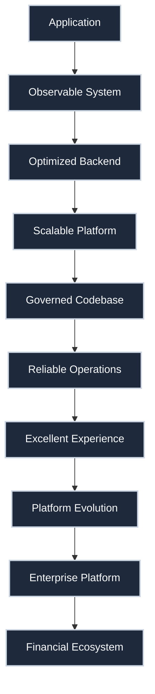

# Ledger360 Engineering Roadmap

**Version:** 4.2 (Architecture Approved)  
**Status:** Frozen after review  
**Core Philosophy:** Observe → Measure → Optimize → Scale → Govern → Operate → Experience → Evolve → Enterprise → Expand  
**Owner:** Ledger360 Architecture  

> **Roadmap Governance:** This roadmap is reviewed every six months. New phases may only be added after an architecture review and ADR. Existing phase ordering is considered frozen unless a fundamental architectural change is approved.

---

## Standing Engineering Principles

### 1. Data Integrity First
> Nothing may compromise: Double-entry integrity, Transaction atomicity, Idempotency, Audit trails, Deterministic calculations, and Referential integrity. Financial correctness always wins over performance.

### 2. Evidence-Driven Engineering
> No optimization without evidence. No index, no cache, no partition, no queue, no rewrite, and no infrastructure until metrics prove it is needed.

### 3. Architecture Decision Records (ADRs)
> Every major decision produces an ADR (e.g., `ADR-001 Prisma`). Every ADR must be reviewed every 6–12 months. (Keep, Replace, Deprecate, Supersede).

### 4. Domain Model Governance
> Domain models must evolve deliberately. Every major entity review should evaluate ownership, aggregate boundaries, invariants, duplication, and long-term maintainability. Domain changes require an ADR.

### 5. Technical Debt Register
> No scattered TODOs. Everything deferred is intentionally tracked in `docs/technical-debt.md`.

### 6. Prefer Deletion Over Addition
> Every phase should remove more complexity than it adds. Delete duplicate code, dead APIs, obsolete DTOs, unused dependencies, abandoned migrations, AI artifacts, and temporary utilities.

### 7. Performance Regression Gates
> Every PR must pass: TypeScript, Tests, Build, Performance budgets, Query budgets, Payload budgets, Memory budgets, Bundle budgets, and introduce no new N+1 queries.

### 8. Architecture Review Gate
> Before each phase confirm: Architecture is still appropriate, Simpler solution doesn't exist, Metrics justify work, Security reviewed, and Technical debt addressed.

### 9. Build Artifact Policy
> Production contains ONLY Application, Infrastructure, Configuration, and Documentation. NEVER Planning docs, AI conversations, Scratch files, Benchmark datasets, Walkthroughs, or Temporary SQL.

### 10. AI Governance
> AI-generated code must meet the same engineering, testing, security, documentation, and review standards as human-written code. AI outputs are drafts, not approvals.

---

## Architecture Success Metrics
The platform's North-Star engineering objectives:
- **Build Time:** <5 minutes
- **Average Endpoint Latency:** <200ms
- **P95 Dashboard Latency:** <300ms
- **Failed Requests:** <0.1%
- **Error Budget Burn:** <25%
- **Critical Bugs:** 0
- **Dead Code:** 0
- **Circular Dependencies:** 0
- **Bundle Growth:** <5%
- **Accessibility:** WCAG AA

---

## Universal Definition of Done
Every work order must include:
- [ ] Code
- [ ] Tests
- [ ] Documentation
- [ ] ADR (if architecture changed)
- [ ] Technical Debt Register updated
- [ ] Benchmarks executed (if performance changed)
- [ ] Observability added
- [ ] Rollback Plan
- [ ] Security Review

---

## Phase 4A: Performance Baseline (✅ Complete)
**Purpose:** Observe. Never optimize.
**Deliverables:** Request profiling, Query profiling, Repository metrics, Benchmark datasets, k6, Capacity model, Performance budgets.
**Exit:** Complete observability.

## Phase 4A.6: Performance Forensics (Next)
**Purpose:** Generate evidence.
**Deliverables:** Top 20 slow endpoints, slow queries, payloads, N+1 offenders, expensive aggregations, memory consumers.
**Output:** Optimization backlog ranked by impact.

## Phase 4B: Database Engineering & Data Access Locality
Everything justified with EXPLAIN ANALYZE.

### Investigation: Data Access Locality (Working-Set Reduction)
Evaluate whether endpoints can reduce the amount of historical data read by using:
- Temporal filtering
- Cursor pagination
- Bounded reporting windows
- Workload-specific query strategies

Distinguish clearly between **validation workloads**, which require exact current state and cannot arbitrarily limit history, and **reporting or browsing workloads**, which can safely operate on bounded date ranges or paginated datasets. Document workload classification for each hotspot before selecting an optimization strategy.

Includes Index audit, Composite/Partial/Covering indexes, Materialized views, Summary tables, Cursor pagination, Vacuum analysis, Connection pool tuning, Search strategy evaluation (FTS/Typesense/Meilisearch).
**Exit:** Every optimization measured and workload classified.

## Phase 4C: Backend Platform Optimization
**Purpose:** Make APIs efficient and stable. (No frontend work here).
Includes DashboardService, API inventory, SQL filtering, DTO audit, Payload trimming, Compression, API versioning, Cursor pagination rollout, Contract stability.

## Phase 4D: Caching Platform
Includes React cache, Redis, Invalidation, Stampede protection, Cache taxonomy, Background refresh.
**Exit:** Documented invalidation for every cached endpoint.

## Phase 4E: Scalability Platform
Includes Queues, Workers, Blob storage, PgBouncer, Read replicas, Autoscaling, Rate limiting, Statelessness, Infrastructure as Code.

## Phase 4F: Database Partitioning
Only if evidence proves necessity.
**Triggers:** 50M+ rows, 25GB+ indexes, Long vacuums, Sequential scans. Otherwise, do nothing.

## Phase 4G: Codebase Governance & Sustainability
This becomes the "cleanup" phase ensuring codebase health before further growth.
Includes Dead code elimination, Dependency pruning, Repository restructuring, Naming standardization, Migration cleanup, Feature flag cleanup, Logging cleanup, AI artifact cleanup, Documentation cleanup, Build artifact audit, Configuration cleanup, Deletion budget.

## Phase 4H: Architecture Fitness
Automated CI enforcement. Rules: No dead exports, No circular dependencies, No invalid Prisma imports, No production test imports, No orphaned routes, No unused dependencies. Includes Architecture fitness score, Trend dashboards, Cost dashboards, Capacity forecasts.

## Phase 4I: Operational Excellence
Running the platform. Includes Runbooks, Monitoring, Alerts, SLOs, SLAs, Incident response, MTTR, MTBF, Canary, Blue/Green, Rollback automation, Disaster drills, Synthetic monitoring.

---

## Phase 5A: Design System
**Purpose:** Build the visual foundation.
- **Visuals:** Tokens, Typography, Spacing, Iconography, Motion, Theming (Dark mode).
- **Accessibility Foundation:** WCAG AA, Contrast, Focus rings, Reduced motion settings.

## Phase 5B: Experience Engineering
**Purpose:** Transform Ledger360 into a polished financial application using the Design System.
- **Component Library:** Buttons, Tables, Charts, Forms, Cards, Dialogs, Date Pickers, Currency Inputs.
- **Financial UX:** Budget flows, Goals, Loans, Net Worth, Cash Flow, Reports, Financial visualizations.
- **UX Engineering:** Onboarding, Workflows, Usability testing, Interaction design, Animations.
- **Frontend Performance:** Hydration, React rendering, LCP, CLS, INP, Bundle size, Code splitting, Image optimization, Font loading.
- **Mobile Strategy:** Smaller payloads, Pagination assumptions, Offline sync, Network resilience, Battery consciousness, Touch interactions, Background sync. Every API supports Web, Android, iOS, Desktop without modification.
- **Progressive Web App Readiness:** Offline mode, Sync queue, Installable app, Push notifications.

---

## Phase 6: Platform Evolution
OpenTelemetry, Domain events, Outbox, Saga, Circuit breakers, Retry policies. (Not microservices for the sake of it—just architectural capabilities).

## Phase 7: Enterprise Readiness
SOC2, GDPR, Disaster Recovery, PII Governance, Encryption, Compliance, Chaos Engineering, Multi-region, Secrets rotation.
**Disaster Recovery Testing:** Recovery drills (twice yearly), Backup restore validation (quarterly).

## Phase 8: Product Expansion
Open Banking, AI, Payroll, Investments, Tax, Invoices, Public APIs, Developer Platform, Multi-currency.

---

## Appendix A: Testing Evolution
Testing matures alongside the platform:
- **Phase 4:** Unit, Integration, Performance, Load
- **Phase 5:** Contract, Consumer-driven
- **Phase 6:** Chaos, Disaster Recovery
- **Phase 7:** Synthetic production monitoring
- **Financial Correctness Testing:** Property-based tests, Golden dataset verification, Regression calculations, Cross-ledger reconciliation, Balance/Net worth/Cashflow verification.

## Appendix B: Lifecycle Governance
- **Observability:** `Structured Logs` → `Metrics` → `Distributed Tracing` → `Business Metrics` → `Predictive Alerting`
- **API Lifecycle:** `Experimental` → `Internal` → `Partner` → `Public` → `Deprecated` → `Removed`
- **Dependency Governance:** `Candidate` → `Approved` → `Core` → `Deprecated` → `Removal Candidate` → `Removed`
- **Feature Lifecycle:** `Idea` → `Experimental` → `Beta` → `GA` → `Deprecated` → `Archived` → `Deleted`
- **Data Classification:** `Public` → `Internal` → `Confidential` → `Financial` → `PII` → `Highly Sensitive`
- **Financial Data Lifecycle:** `Hot Data (Current month)` → `Warm Data (Current year)` → `Cold Data (Older years)` → `Historical Data (Read-only/Partition Eligible)`

## Appendix C: Release Versioning & Operations
- **Release Strategy:** `Major` → `Minor` → `Patch` → `Hotfix` → `LTS`
- **Cost Engineering Metrics:** Track Cost per request, Cost per MAU, Cost per million transactions, Storage growth, Redis growth, Bandwidth, Build minutes, Monitoring cost.

## Appendix D: Engineering Handbook
Maintain the Engineering Handbook (`docs/engineering/`) continuously alongside the roadmap. It should cover: Architecture overview, Coding standards, ADR index, Runbooks, CI/CD guide, Security standards, Testing, Performance, Observability, Deployment, and Release processes.

---

## Appendix E: Architecture Evolution

